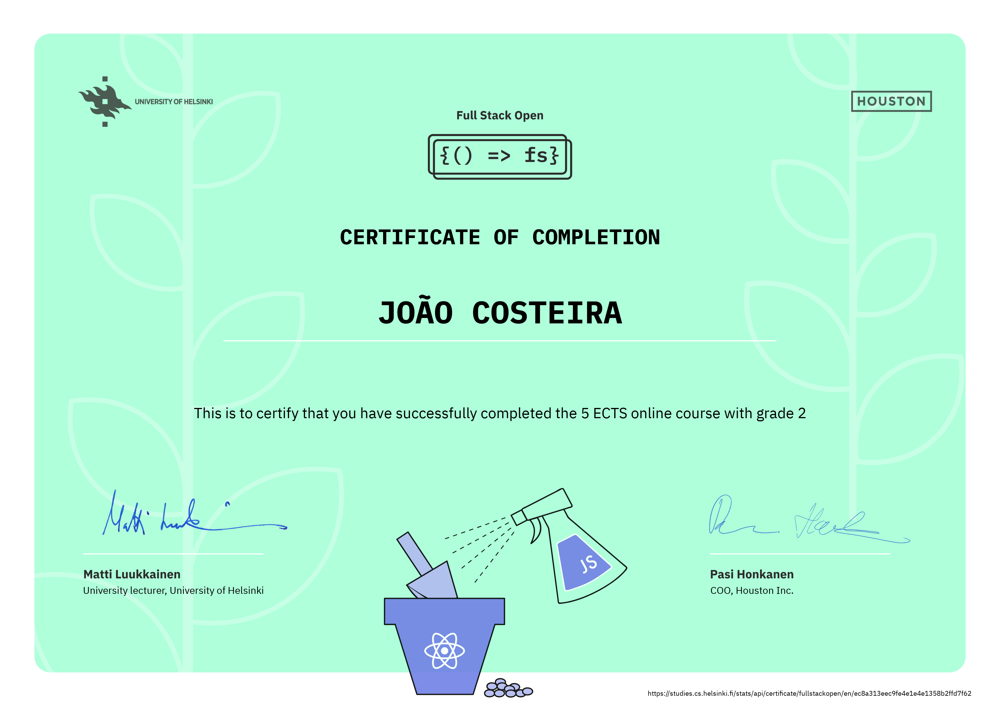

# FullStack Course 2022
Full stack web development course, more information available [here](https://fullstackopen.com/en/about).

## Pokedex
- For completing the entire Part 1 through 4 (Grade 2 = 83 exercises complited)

- For complitying the entire Part 1 through 5 (Grade 4 = 105 or more exercises complited (I've completed 107 exercises))

- For complitying the entire Part 1 through 6 (Grade 5 = 116 or more exercises complited (I've completed 128 exercises))

- After finishing part 7, I achieved 7 etcs
